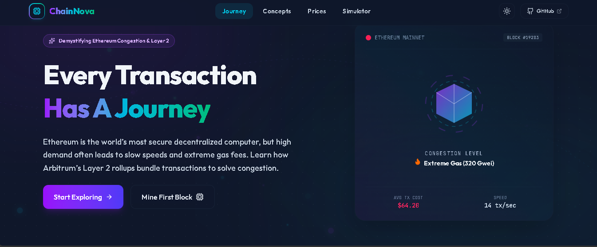
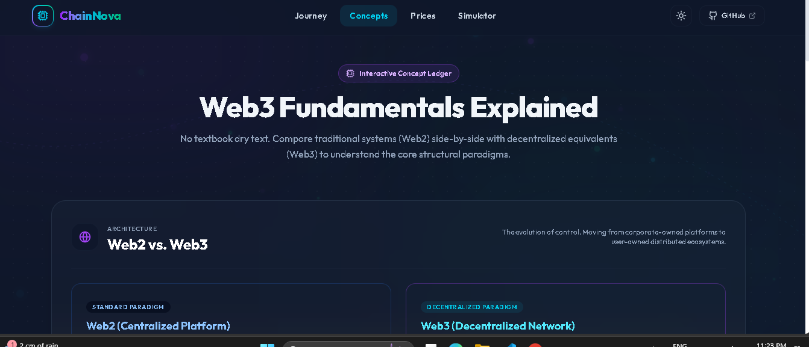
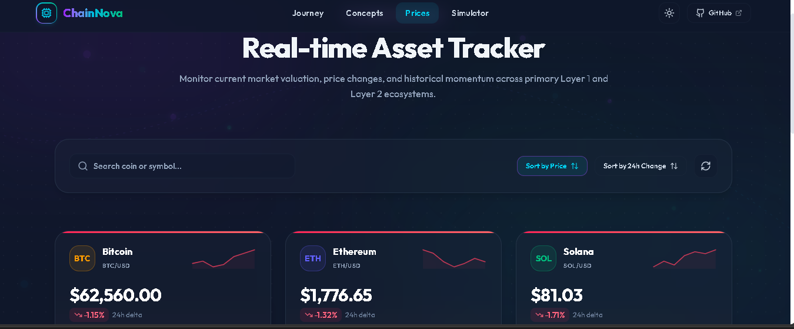
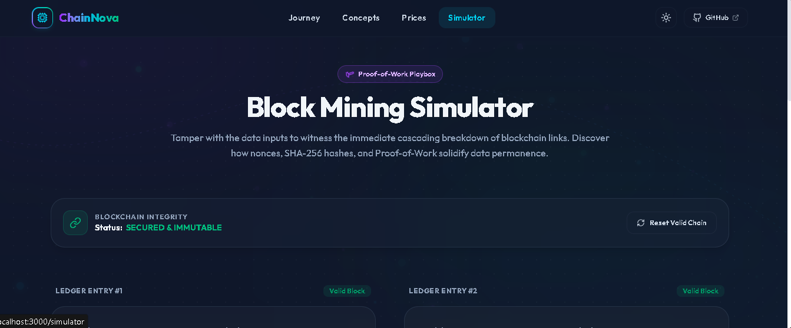

# 🚀 ChainNova

**Explore the Future of Blockchain, One Block at a Time**

ChainNova is a modern educational Web3 website built using **React + Vite**. It is designed to simplify blockchain concepts through interactive visualizations, real-time cryptocurrency data, and hands-on simulations.

Rather than presenting blockchain as plain text, ChainNova focuses on creating an engaging learning experience where users can understand the evolution of Web3, compare key technologies, track live cryptocurrency prices, and experience blockchain immutability through an interactive mining simulator.

---

# ✨ Features

- Modern and responsive UI
- Interactive Web3 learning experience
- Smooth navigation between all pages
- Real-time cryptocurrency prices using CoinGecko API
- Interactive Block Mining Simulator
- Responsive design for desktop and mobile
- Clean and reusable React component architecture

---

# 📄 Pages

## 🏠 1. Home / Landing Page

The landing page introduces users to the world of Web3 through the theme **"Journey of a Transaction."**

It explains:
- Why Ethereum required Layer 2 solutions
- What Arbitrum is
- Benefits of Layer 2
- Key blockchain features
- Modern hero section with attractive visuals

### Screenshot



---

## 📚 2. Concepts

The Concepts page provides easy-to-understand visual comparisons of important blockchain topics.

It includes:

- Web2 vs Web3
- Ethereum vs Bitcoin
- Public Key vs Private Key
- Blockchain vs Traditional Database

Each concept is displayed using comparison cards for better understanding.

### Screenshot



---

## 💰 3. Live Crypto Dashboard

This page displays real-time cryptocurrency prices fetched from the CoinGecko Public API.

Features include:

- Bitcoin price
- Ethereum price
- 24-hour price change
- Green/Red indicators
- Refresh button
- Responsive crypto cards

### Screenshot



---

## ⛏️ 4. Block Mining Simulator

The Block Mining Simulator demonstrates how blockchain mining works using JavaScript.

Features include:

- Block Data input
- Previous Hash
- Nonce
- SHA-256 Hash generation
- Simulated Proof-of-Work
- Block validation
- Chain integrity demonstration

Changing Block 1 automatically invalidates Block 2, illustrating blockchain immutability.

### Screenshot



---

# 🛠️ Tech Stack

- React
- Vite
- JavaScript
- HTML5
- CSS3
- React Router
- CoinGecko Public API
- Web Crypto API

---

# 📦 Installation

Clone the repository

```bash
git clone <>
```

Move into the project directory

```bash
cd ChainNova
```

Install dependencies

```bash
npm install
```

Start the development server

```bash
npm run dev
```

Open your browser and visit

```
http://localhost:5173
```

---

# 📁 Project Structure

```
src/
│
├── components/
├── pages/
├── assets/
├── App.jsx
└── main.jsx
```

---

# 🔮 Future Improvements

- Wallet connection using MetaMask
- Transaction explorer
- Additional cryptocurrency support
- Interactive blockchain animations
- Live gas fee tracker
- Theme customization
- Dark/Light mode
- Price charts with historical data

---

# ⚠️ Known Issues

- CoinGecko API may occasionally enforce rate limits.
- Historical charts are not included in the current version.
- Mining simulation is educational and does not perform real blockchain mining.

---

# 👨‍💻 Author

**Moksha Shah**

Built as part of the **W3 & Arbitrum Blockchain Workshop Assignment**.